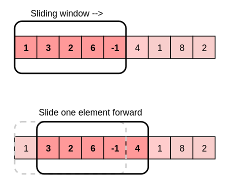

# Sliding Window Pattern
The sliding window pattern is used to solve sub-array (or sub-lists) problems, in which we need to perform some calculation
or an action among all or some of the sub-arrays of a given size.

#### [Pattern explanation video](https://www.youtube.com/watch?v=GcW4mgmgSbw)



In some cases, the size of the sliding window is not fixed, and it needs to be expanded or shrank based on the problem
constraints, giving us two variants of sliding windows:
1. Fixed windows
2. Variable windows

### Examples of Use Cases
- Finding the average of all contiguous sub-arrays of length K in an array.
- Finding the sum of each sub-array of length K in an array.

**Contiguous**: In sequence | Sharing a common border | Next to each other.

### Steps
1. Establish the size of the window.
2. Compute the result for the 1st window (from the start of the data structure).
3. Use a loop to slide the window by 1, and keep computing the result for each window.

<br>

### Pattern Template
```java
/**
 * Time complexity: O(n)
 *      Where n = number of elements in the array.
 * Approach:
 *      Let k = window size, arrLength = array length 
 *      1. Get number of windows => (arrLength - k + 1)
 *      2. Create results array with length of => (numOfWindows)
 *      3. Loop through all array elements
 *          3.1. Add the element at the end
 *          3.2. Once the end of the first window is reached and from that point and on => (i >= k - 1):
 *              3.2.1. Do whatever we want with the window
 *              3.2.2. Subtract element from at the start
 *              3.2.3. Slide the window by moving the start pointer, since end pointer is already moved via loop              
 */
double[] findAverages(int k, int[] arr) {
    int numOfWindows = arr.length - k + 1;
    double[] results = new double[numOfWindows];
    double sum = 0;
    
    int start = 0;
    // Loop through arr elements, moving the end of the window
    for (int end = 0; end < arr.length; end++) {
        
        // Add element at the end
        sum += arr[end];

        // Once we reach, and starting from the end of first window and along (that's when window starts sliding)
        int firstWindowEndIdx = k - 1;
        if (end >= firstWindowEndIdx) {
            
            // Get average and add it to results list
            double avg = sum / k;
            results[start] = avg;
            
            // Subtrack the element at the start
            sum -= arr[start];

            // Slide the window by moving the start pointer (end pointer moved via loop)
            start++;
            
        }
    }
    
    return results;
}
```

<br>

### Brute Force Alternative
```java
/**
 * Time complexity: O(n*k)
 *      Where n = number of elements in the array.
 *            k = window size / sub-array length.
 * Approach:
 *      Let k = window size, arrLength = array length 
 *      1. Get number of windows:
 *          arrLength - k + 1
 *      2. Create results array with length of:
 *          number of windows
 *      3. Loop through array elements until:
 *          arrLength - k (last element before window overflows)
 *      4. Loop through window, starting from element i, until:
 *          i + k (last element in current window)
 */
double[] findAverages(int k, int[] arr) {
    int numOfWindows = arr.length - k + 1;
    double[] results = new double[numOfWindows];
    for (int i = 0; i <= arr.length - k; i++) {
        double sum = 0;
        for (int j = i; j < i + k; j++) {
            sum += arr[j];
        }
        result[i] = sum / k;
    }
    return results;
}
```

<br>

### Neetcode + Blind 75 + Grokking Problems
#### Easy
- [Best Time to Buy and Sell Stock](https://leetcode.com/problems/best-time-to-buy-and-sell-stock/)

#### Medium
- [Maximum Subarray](https://leetcode.com/problems/maximum-subarray/)
- [Longest Substring Without Repeating Characters](https://leetcode.com/problems/longest-substring-without-repeating-characters/)
- [Longest Substring with At Most K Distinct Characters](https://leetcode.com/problems/longest-substring-with-at-most-k-distinct-characters/)
- [Longest Repeating Character Replacement](https://leetcode.com/problems/longest-repeating-character-replacement/)
- [Max Consecutive Ones III](https://leetcode.com/problems/max-consecutive-ones-iii/) 
- [Permutation in String](https://leetcode.com/problems/permutation-in-string/)
- [Anagrams in a String](https://leetcode.com/problems/find-all-anagrams-in-a-string/)
- [Longest Substring Without Repeating Characters](https://leetcode.com/problems/longest-substring-without-repeating-characters/)
- [Minimum Size Subarray Sum](https://leetcode.com/problems/minimum-size-subarray-sum/)
- [Fruit Into Baskets](https://leetcode.com/problems/fruit-into-baskets/)

#### Hard
- [Minimum Window Substring](https://leetcode.com/problems/minimum-window-substring/)
- [Sliding Window Maximum](https://leetcode.com/problems/sliding-window-maximum/)
- [Substring with Concatenation of All Words](https://leetcode.com/problems/substring-with-concatenation-of-all-words/)

### [More Sliding Window Problems (73)](https://leetcode.com/tag/sliding-window/)
