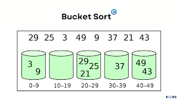

# Bucket Sort
The bucket sort involves dividing elements into different "buckets" or groups. It divides the input array into a number 
of "buckets," each representing a range of values.



### Process:
1. Create an array of empty buckets (or lists)
2. Iterate through the input array, placing each element into its corresponding bucket based on its value
3. Possibly, sort the elements within each bucket (often using another sorting algorithm)
4. Concatenate the sorted buckets to get the final sorted array

### [Pattern explanation video](https://www.youtube.com/watch?v=VuXbEb5ywrU)

---

### Applications
- Frequency counting and top K elements: 
  - Problems that ask to find the most frequent elements or top K frequent elements
- Range-based problems:
  - Problems involving elements within a specific range (LeetCode 220)
- Sorting problems with known value ranges:
  - When the problem constraints specify a limited range of values e.g. Sorting an array of integers where all elements 
  are in the range [0, 1000]
- String sorting based on certain criteria (frequent of chars for example)
- Time-based data structures (LeetCode 981)
- Maximum gap problems:
  - Finding the maximum difference between successive elements in a sorted version of an array (LeetCode 164)
- Duplicate detection:
  - Identifying duplicates within a certain range (LeetCode 442)

---

## Pattern Templates
```java
import java.util.*;

public class BucketSort {
  public static List<Integer> bucketSort(int[] nums, int k) {
    // Step 1: Count the frequency of each element
    Map<Integer, Integer> frequencyMap = new HashMap<>();
    for (int num : nums) {
      frequencyMap.put(num, frequencyMap.getOrDefault(num, 0) + 1);
    }

    // Step 2: Create buckets (List of Lists)
    List<List<Integer>> buckets = new ArrayList<>();
    for (int i = 0; i <= nums.length; i++) {
      buckets.add(new ArrayList<>());
    }

    // Step 3: Add elements to buckets based on frequency
    for (Map.Entry<Integer, Integer> entry : frequencyMap.entrySet()) {
      int num = entry.getKey();
      int frequency = entry.getValue();
      buckets.get(frequency).add(num);
    }

    // Step 4: Collect elements from buckets in reverse order
    List<Integer> result = new ArrayList<>();
    for (int i = buckets.size() - 1; i >= 0 && result.size() < k; i--) {
      result.addAll(buckets.get(i));
    }

    return result;
  }
}
```

<br>

### Neetcode + Blind 75 + Google problems
#### Easy
- [Sort Array by Increasing Frequency](https://leetcode.com/problems/sort-array-by-increasing-frequency/)
- [Relative Sort Array](https://leetcode.com/problems/relative-sort-array/)

#### Medium
- [Top K Frequent Elements](https://leetcode.com/problems/top-k-frequent-elements/)
- [Sort Characters By Frequency](https://leetcode.com/problems/sort-characters-by-frequency/)
- [Sort Array by Increasing Frequency](https://leetcode.com/problems/sort-array-by-increasing-frequency/)
- [Top K Frequent Words](https://leetcode.com/problems/top-k-frequent-words/)

#### Hard
- [Maximum Gap](https://leetcode.com/problems/maximum-gap/)

#### Google
- [First Unique Character in a String](https://leetcode.com/problems/first-unique-character-in-a-string/)
- [Design HashMap](https://leetcode.com/problems/design-hashmap/)
- [Design Underground System](https://leetcode.com/problems/design-underground-system/)

### [More Bucket Sort Problems](https://leetcode.com/tag/bucket-sort/)
