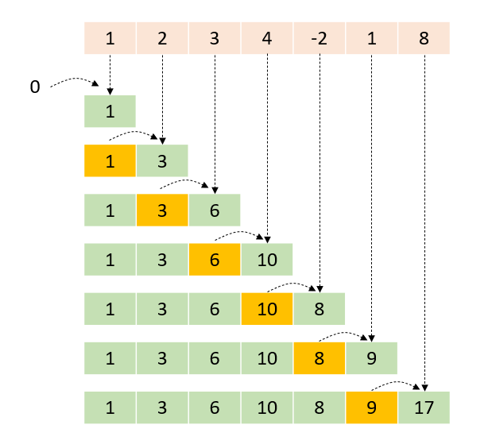

# Prefix Sum Algorithm
The prefix sum algorithm, also known as the cumulative sum or prefix sum, is a technique used to efficiently compute 
the cumulative sum (or product or division or whatever) of elements in an array, where each element in the resulting 
array is the sum of all elements in the original array up to a certain position. The prefix sum array allows for quick 
retrieval of cumulative sums for various sub-arrays.

**So basically, cumulative operations for elements in an array.**

Also Used when we're doing some calculation on an array, where we want to save computation or memory by storing the 
computation for the previous indexes in a prefix array. Sort of like building a hashmap which returns the result 
of an array elements computation instantly, without any recalculation.

### Patters:
- Do *something* for all elements in array except element at index i
- Do *something* for all elements in array until element at index i
  - We store values of doing the *thing* for all previous elements until element at index i in prefix array.


### [Pattern explanation video](https://www.youtube.com/watch?v=7pJo_rM0z_s)



---

### Applications
- **Efficient range sum queries**: With the prefix sum array, you can calculate the sum of elements in a specific 
sub-array efficiently. To find the sum of elements between positions start and end in arr, you can simply subtract 
prefix[start-1] from prefix[end], i.e., prefix[end] - prefix[start-1]. If start is 0, you don't need to subtract 
prefix[start-1].
- **Efficient average calculations**: You can use the prefix sum array to compute the average of elements in any 
sub-array by using the method described above and dividing by the number of elements in the subarray. 
- **Efficient updates**: If you need to update a single element in the original array, you can update the corresponding 
element in the prefix sum array as well. This allows you to maintain the cumulative sum efficiently when there are 
updates.
- **Range sum queries**: Quickly calculate the sum of elements between any two indices
- **Cumulative calculations**: Problems involving running totals or cumulative data
- **Sub-array sum problems**: Finding subarrays with a particular sum or property
- **2D array problems**: Can be extended to 2D prefix sums for efficient 2D range queries
- **Time series analysis**: Analyzing cumulative data over time periods
- **Sliding window problems**: Can be used in conjunction with sliding window technique

---

### Process
1. Create a new array of the same length as the input array
2. Set the first element of the prefix sum array to be the same as the first element of the input array
3. Iterate through the input array, calculating the cumulative sum at each position
4. Store each cumulative sum in the corresponding position of the prefix sum array

## Template

```java
/**
 * Time complexity: O(n)
 *      Where n = number of elements in the array.  
 */
public class PrefixSum {
  List<Integer> prefixSum = new ArrayList<>();

  public PrefixSum(int[] nums) {
    int total = 0;
    for (int num : nums) {
      total += num;
      prefixSum.add(total);
    }
  }                                                                                                                                           

  public int rangeSum(int leftIndex, int rightIndex) {
    int right = prefixSum.get(rightIndex);
    int left = leftIndex > 0 ? prefixSum.get(leftIndex - 1) : 0;
    return right - left;
  }
}
```

<br>

### Neetcode + Blind/Grind 75 + Company Specific
#### Easy
- [Best Time to Buy and Sell Stock](https://leetcode.com/problems/best-time-to-buy-and-sell-stock/)

#### Medium
- [Maximum Subarray](https://leetcode.com/problems/maximum-subarray/)
- [Longest Substring Without Repeating Characters](https://leetcode.com/problems/longest-substring-without-repeating-characters/)
- [Longest Substring with At Most K Distinct Characters](https://leetcode.com/problems/longest-substring-with-at-most-k-distinct-characters/)
- [Longest Repeating Character Replacement](https://leetcode.com/problems/longest-repeating-character-replacement/)
- [Max Consecutive Ones III](https://leetcode.com/problems/max-consecutive-ones-iii/)
- [Permutation in String](https://leetcode.com/problems/permutation-in-string/)
- [Anagrams in a String](https://leetcode.com/problems/find-all-anagrams-in-a-string/)
- [Longest Substring Without Repeating Characters](https://leetcode.com/problems/longest-substring-without-repeating-characters/)
- [Minimum Size Subarray Sum](https://leetcode.com/problems/minimum-size-subarray-sum/)
- [Fruit Into Baskets](https://leetcode.com/problems/fruit-into-baskets/)

#### Hard
- [Minimum Window Substring](https://leetcode.com/problems/minimum-window-substring/)
- [Sliding Window Maximum](https://leetcode.com/problems/sliding-window-maximum/)
- [Substring with Concatenation of All Words](https://leetcode.com/problems/substring-with-concatenation-of-all-words/)

### [More Sliding Window Problems (73)](https://leetcode.com/tag/sliding-window/)
